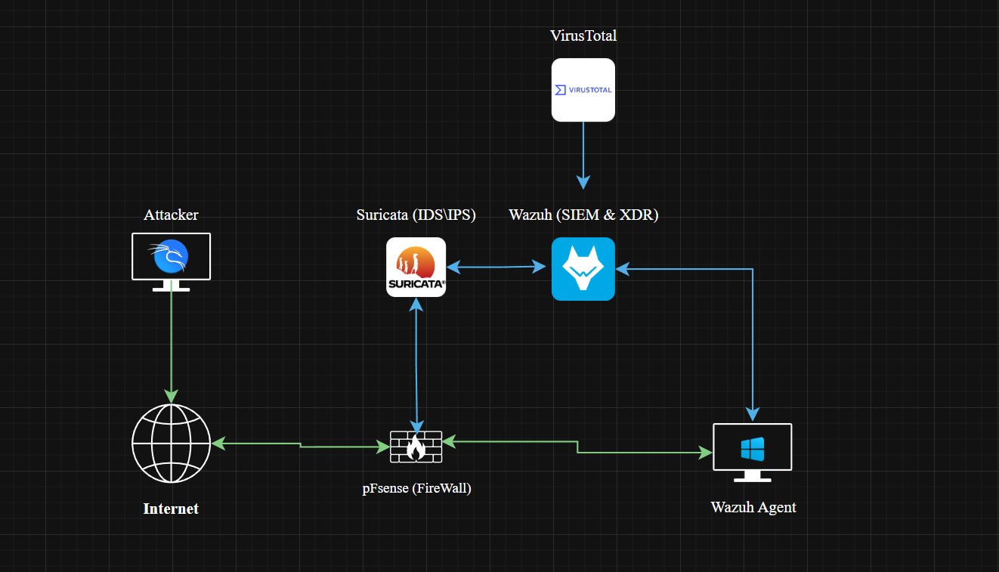

# Project Overview

## Project Purpose

This project builds a complete SOC home lab around Wazuh SIEM/XDR. The lab centralizes endpoint, firewall, IDS, file-integrity, threat-intelligence, Sysmon, and authentication-failure evidence so security activity can be reviewed from one monitoring workflow.

The project is not only a tool installation walkthrough. It shows how the different parts of a SOC lab support each other: the Wazuh agent collects endpoint data, pfSense provides firewall visibility, Suricata adds IDS alerts, VirusTotal enriches file-related alerts, Sysmon improves Windows telemetry, and Hydra provides a controlled brute-force test case.

## What Is SIEM

SIEM stands for Security Information and Event Management. A SIEM platform collects, normalizes, stores, and analyzes security data from many sources such as endpoints, servers, firewalls, IDS sensors, applications, and users. The collected data usually includes logs, alerts, event metadata, authentication records, network events, and security-tool findings.

In a SOC, SIEM is important because it gives analysts one place to monitor activity instead of checking each system separately. It supports real-time monitoring, searching across different log sources, correlating related events, and triggering alerts when suspicious behavior appears.

Wazuh is used in this project as the SIEM/XDR platform because it is open source, practical for lab deployment, and supports multiple security functions in one environment. These include threat detection, file integrity monitoring, compliance reporting, incident-response support, agent telemetry collection, and integrations with tools such as VirusTotal.

## Wazuh Architecture

Wazuh is built from several parts that work together. The Wazuh agent is installed on monitored endpoints and collects local telemetry such as Windows events, Sysmon events, file changes, and security logs. The Wazuh manager receives that data, decodes it, applies rules, and generates alerts. The Wazuh indexer stores the alerts and event data so they can be searched quickly. The Wazuh dashboard provides the web interface used by the analyst to view alerts, investigate events, and track security posture.

This architecture matters because the lab is not based on one screenshot or one tool. It demonstrates a monitoring pipeline: endpoint and network activity is collected, parsed, stored, enriched, displayed, and then reviewed as security evidence.

## Scenario and Lab Architecture

The lab is built with VMware virtual machines. Wazuh acts as the central SIEM/XDR platform, a Windows endpoint runs the Wazuh agent, Kali Linux simulates attacker activity, pfSense routes and logs firewall traffic, Suricata inspects network traffic, and VirusTotal provides external reputation context.

> A useful SOC lab needs more than one log source. Firewall, IDS, endpoint, and Windows event data give different views of the same environment, which helps analysts separate isolated alerts from real attack patterns.

<strong>Screenshot 001 - Wazuh SOC Lab Architecture:</strong> The replacement topology diagram shows the attacker path, pfSense firewall, Suricata IDS/IPS sensor, Wazuh SIEM/XDR server, VirusTotal enrichment, and Windows Wazuh agent.

The architecture confirms the intended telemetry flow: network traffic passes through pfSense, Suricata monitors traffic and sends alerts to Wazuh, the Windows endpoint reports through the Wazuh agent, and VirusTotal enriches suspicious artifact investigations.

## Technical Scope

| Area | Description |
|------|-------------|
| Infrastructure | VMware-based Wazuh server, Windows endpoint, Kali attacker VM, pfSense firewall, and Suricata sensor |
| Security Focus | Centralized monitoring, endpoint telemetry, firewall logging, IDS alerts, file integrity monitoring, threat-intelligence enrichment, and brute-force detection |
| Evidence | Screenshots, commands, XML/YAML configuration snippets, Wazuh dashboard views, Windows event fields, and Hydra simulation output |
| Output | Root README, chapter READMEs, image manifest, reusable configuration snippets, command reference, and Windows Event 4625 field analysis |

## Project Goals

- Deploy and access the Wazuh SIEM/XDR dashboard.
- Register a Windows endpoint as an active Wazuh agent.
- Forward pfSense firewall logs into Wazuh through syslog.
- Ingest Suricata EVE JSON alerts through the Wazuh agent.
- Configure VirusTotal enrichment for file-related alerts.
- Enable File Integrity Monitoring on a Windows folder.
- Configure Sysmon EventChannel ingestion for enhanced endpoint visibility.
- Simulate and detect SSH brute-force activity with Hydra and Windows Event 4625 evidence.

## Final Result

The lab demonstrates a complete monitoring workflow where Wazuh receives and presents endpoint, firewall, IDS, file-change, threat-intelligence, Sysmon, and authentication-failure data. The evidence confirms that the Wazuh dashboard was accessible, the Windows endpoint was enrolled, Suricata alerts appeared in Wazuh, FIM file-change alerts were generated, and SSH brute-force activity was detected.

Some areas still require deeper production validation. pfSense decoder matching should be tested with live `filterlog` samples, VirusTotal enrichment should be validated with a safe test file, and Suricata rules should be tuned against realistic traffic before relying on them in a production environment.

## Evidence Summary

| Evidence Type | What It Confirms |
|--------------|------------------|
| Screenshots | Dashboard access, active agent registration, pfSense configuration, Suricata ingestion, VirusTotal setup, FIM alerts, and brute-force detection |
| Commands | Service checks, endpoint enrollment, Suricata execution, Wazuh service restarts, Sysmon setup, and Hydra simulation |
| Logs / Alerts | Wazuh Threat Hunting alerts for Suricata, FIM, and SSH failed-logon activity |
| Configs | Wazuh syslog input, pfSense parsing rules, Suricata EVE output, VirusTotal integration, FIM syscheck, and Sysmon EventChannel collection |

## Chapter Map

| Chapter | What It Covers |
|---------|----------------|
| [Wazuh Server and Agent Onboarding](../02-wazuh-server-agent-onboarding/README.md) | Wazuh OVA access, service troubleshooting, and Windows endpoint enrollment |
| [pfSense Log Integration](../03-pfsense-log-integration/README.md) | Firewall setup, remote syslog forwarding, and Wazuh parsing logic |
| [Suricata IDS Integration](../04-suricata-ids-integration/README.md) | IDS installation, EVE JSON output, localfile ingestion, and alert validation |
| [VirusTotal Threat Intelligence](../05-virustotal-threat-intelligence/README.md) | API key handling, manager integration, and monitored directory setup |
| [File Integrity Monitoring](../06-file-integrity-monitoring/README.md) | Windows folder monitoring and file-change alert validation |
| [Sysmon Log Ingestion](../07-sysmon-log-ingestion/README.md) | Windows Event Log concepts, Sysmon setup, and EventChannel collection |
| [SSH Brute Force Detection](../08-ssh-brute-force-detection/README.md) | Hydra simulation, Wazuh alerts, and Windows Event 4625 analysis |
| [Final Summary](../09-final-summary/README.md) | Confirmed results, evidence limits, skills, and defensive recommendations |

---

## Project Chapters

| Chapter | Description |
|---------|-------------|
| [Project Overview](../01-project-overview/README.md) | Scenario, architecture, tools, and lab traffic flow |
| [Wazuh Server and Agent Onboarding](../02-wazuh-server-agent-onboarding/README.md) | Wazuh OVA deployment, dashboard access, service recovery, and Windows agent registration |
| [pfSense Log Integration](../03-pfsense-log-integration/README.md) | Firewall VM setup, remote syslog forwarding, and Wazuh decoder/rule logic |
| [Suricata IDS Integration](../04-suricata-ids-integration/README.md) | Suricata installation, EVE JSON logging, Wazuh ingestion, and alert validation |
| [VirusTotal Threat Intelligence](../05-virustotal-threat-intelligence/README.md) | API key handling, Wazuh manager integration, and monitored directory enrichment |
| [File Integrity Monitoring](../06-file-integrity-monitoring/README.md) | Windows FIM configuration and file create/modify/delete alert validation |
| [Sysmon Log Ingestion](../07-sysmon-log-ingestion/README.md) | Windows Event Log concepts, Sysmon installation, and EventChannel ingestion |
| [SSH Brute Force Detection](../08-ssh-brute-force-detection/README.md) | Hydra simulation, Wazuh detection, Windows Event 4625 analysis, and defensive controls |
| [Final Summary](../09-final-summary/README.md) | Results, limitations, skills, and hardening recommendations |
