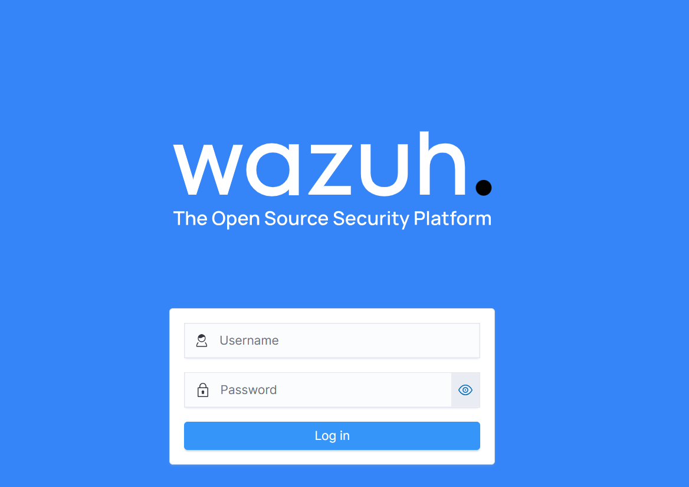
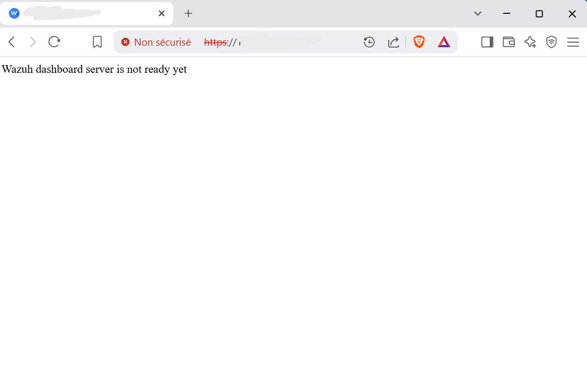
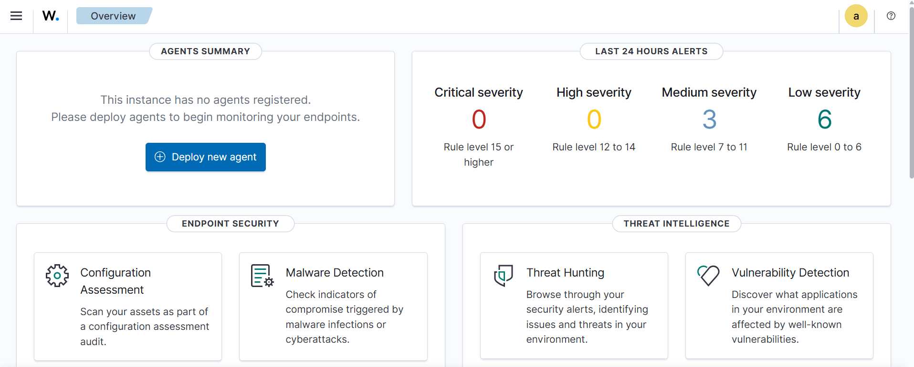
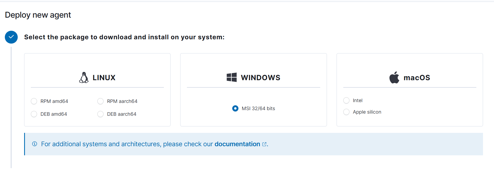
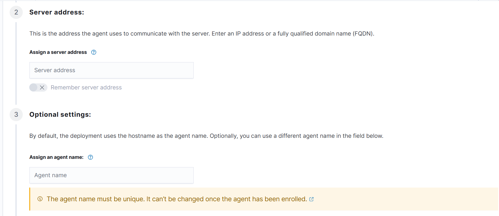
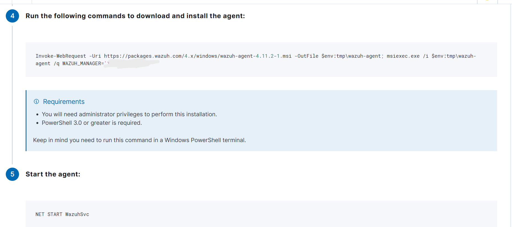
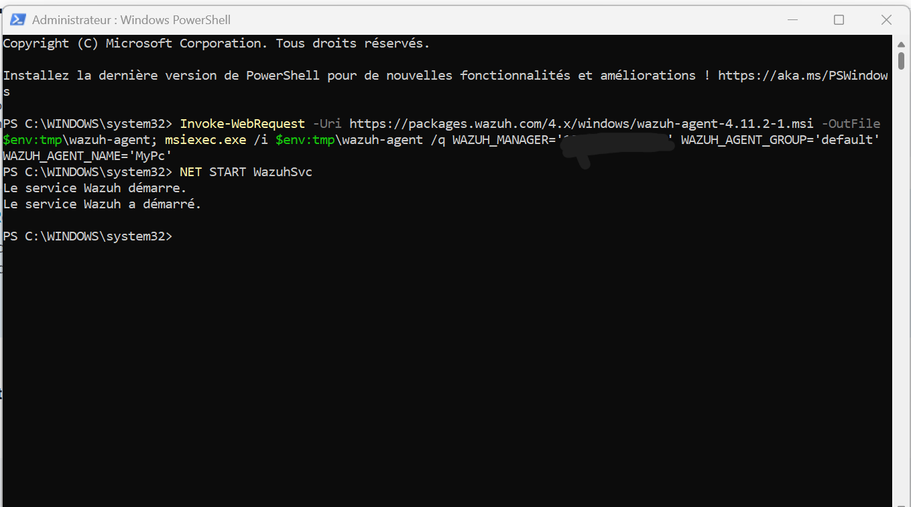
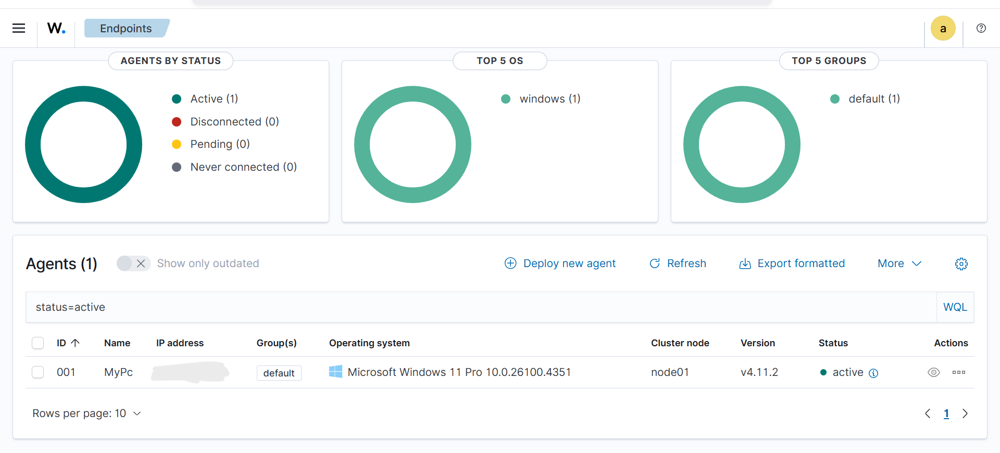

# Wazuh Server and Agent Onboarding

This chapter combines Wazuh server deployment with Windows agent onboarding. The Wazuh server provides the manager, indexer, and dashboard, while the Windows agent collects endpoint telemetry and forwards it to the manager.

## Technical Context

Wazuh provides an OVA virtual appliance that packages the manager, indexer, and dashboard into one VMware-ready VM. The manager receives and decodes events, the indexer stores searchable data, and the dashboard provides the analyst interface.

The Windows endpoint is enrolled with the Wazuh agent, which collects local telemetry and forwards it to the manager. In this lab, that same agent later supports File Integrity Monitoring, Sysmon collection, Suricata log ingestion, and failed-logon visibility.

**Implemented controls:**

- Imported and accessed the Wazuh OVA appliance.
- Recovered the dashboard when backend services were not ready.
- Generated the Windows agent deployment commands.
- Registered and validated the Windows endpoint as an active Wazuh agent.

---

## Detailed Walkthrough

### Step 01 - Import the Wazuh OVA and Find the Server IP

The Wazuh OVA is imported into VMware and started as the central SIEM VM. After boot, the server IP is identified so the dashboard can be reached through a browser.

> The Wazuh server is the central collection and analysis point. If its IP address is wrong or unreachable, no endpoint onboarding or dashboard validation can happen. The dashboard may be the visible interface, but it depends on the manager and indexer services behind it.

```bash
ifconfig
```



<p><sub><strong>Screenshot 002 - Wazuh Login Page:</strong> The Wazuh login page is reachable over HTTPS, confirming that the browser can reach the Wazuh dashboard service.</sub></p>

The login page confirms network reachability to the Wazuh server.

---

### Step 02 - Recover the Dashboard When Services Are Not Ready

The dashboard can show a server-not-ready message when Wazuh services are not fully running. The manager, dashboard, and indexer services are checked and started from the appliance terminal.

> The dashboard depends on backend services. The web page may load while the application is still unable to query the manager or indexer, so service status must be validated on the server.

```bash
sudo su
systemctl status wazuh-manager
systemctl start wazuh-manager
systemctl status wazuh-dashboard
systemctl start wazuh-dashboard
systemctl status wazuh-indexer
systemctl start wazuh-indexer
```



<p><sub><strong>Screenshot 003 - Dashboard Server Not Ready:</strong> The browser shows that Wazuh is reachable but the dashboard backend is not ready, which points to a service readiness issue rather than a network outage.</sub></p>



<p><sub><strong>Screenshot 004 - Main Wazuh Dashboard:</strong> The Wazuh dashboard loads after the required services are running, confirming successful access to the SIEM interface.</sub></p>

The evidence confirms that the service issue was resolved and the dashboard became usable for agent deployment and later investigation steps.

---

### Step 03 - Generate the Windows Agent Deployment

The dashboard is used to deploy a Windows agent. The manager address is entered, and a unique agent name such as `PC1` is assigned.

> The agent is the endpoint sensor. Choosing the correct operating system package matters because Windows, Linux, and macOS agents are installed differently. Agent names make endpoint telemetry easier to identify in alerts, dashboards, and threat-hunting views.



<p><sub><strong>Screenshot 005 - Windows Agent Package Selection:</strong> The deployment workflow is set to Windows, matching the endpoint that will forward logs to Wazuh.</sub></p>



<p><sub><strong>Screenshot 006 - Agent Server Address and Name:</strong> The Wazuh manager address and endpoint name are entered before the dashboard generates registration commands.</sub></p>

The server address binds the endpoint to the correct manager. The agent name becomes the endpoint identity visible in Wazuh.

---

### Step 04 - Register and Start the Windows Agent

Wazuh generates the Windows enrollment commands after the platform, manager address, and agent name are configured. The commands are run in an Administrator PowerShell session to install, register, and start the agent service.

> The registration command is the bridge between the endpoint and the manager. Installation alone is not enough; the agent must also know where to send telemetry and must start its Windows service.

```powershell
Invoke-WebRequest -Uri https://packages.wazuh.com/4.x/windows/wazuh-agent-4.11.2-1.msi -OutFile $env:tmp\wazuh-agent
msiexec.exe /i $env:tmp\wazuh-agent /q WAZUH_MANAGER="<WAZUH_MANAGER_IP>"
NET START WazuhSvc
```



<p><sub><strong>Screenshot 007 - Generated Agent Commands:</strong> The dashboard provides the command sequence needed to install and enroll the Windows agent.</sub></p>



<p><sub><strong>Screenshot 008 - PowerShell Agent Registration:</strong> PowerShell runs the generated Wazuh agent commands with administrator privileges on the Windows endpoint.</sub></p>



<p><sub><strong>Screenshot 009 - Active Wazuh Agent:</strong> The Windows endpoint appears as an active agent, confirming successful enrollment and communication with the Wazuh server.</sub></p>

The active status validates that the endpoint is registered and sending data to Wazuh. This is the foundation for later FIM, Sysmon, and brute-force detection work.

After installation, the Windows agent files are stored under `C:\Program Files (x86)\ossec-agent`. This location is used later when editing `ossec.conf` for File Integrity Monitoring, VirusTotal-triggering paths, Suricata log collection, and Sysmon EventChannel collection.

---

## Validation and Summary

The Wazuh dashboard loads successfully, the service-readiness issue is resolved, and the Windows endpoint appears as an active Wazuh agent. This confirms server availability, endpoint communication, and the base telemetry path required for FIM, Sysmon, Suricata log collection, and brute-force detection.

---

## Project Chapters

| # | Chapter | Description |
|---|---------|-------------|
| 0 | [Project Overview](../../README.md) | Main project overview, objectives, tools, and skills |
| 1 | [Topology and Lab Environment](../01-topology-and-lab-environment/README.md) | Lab architecture, component roles, telemetry flow, and trust boundaries |
| 2 | [Wazuh Server and Agent Onboarding](../02-wazuh-server-agent-onboarding/README.md) | Wazuh OVA access, service recovery, and Windows agent registration |
| 3 | [pfSense Log Integration](../03-pfsense-log-integration/README.md) | Firewall setup, remote syslog forwarding, and Wazuh decoder/rule logic |
| 4 | [Suricata IDS Integration](../04-suricata-ids-integration/README.md) | Suricata EVE JSON logging, Wazuh ingestion, and alert validation |
| 5 | [VirusTotal Threat Intelligence](../05-virustotal-threat-intelligence/README.md) | API key handling, Wazuh manager integration, and monitored directory enrichment |
| 6 | [File Integrity Monitoring](../06-file-integrity-monitoring/README.md) | Windows FIM configuration and file-change alert validation |
| 7 | [Sysmon Log Ingestion](../07-sysmon-log-ingestion/README.md) | Windows Event Log concepts, Sysmon setup, and EventChannel ingestion |
| 8 | [SSH Brute Force Detection](../08-ssh-brute-force-detection/README.md) | Hydra simulation, Wazuh detection, and Windows Event 4625 analysis |
| 9 | [Final Summary](../09-final-summary/README.md) | Validation summary, production recommendations, and skills demonstrated |
