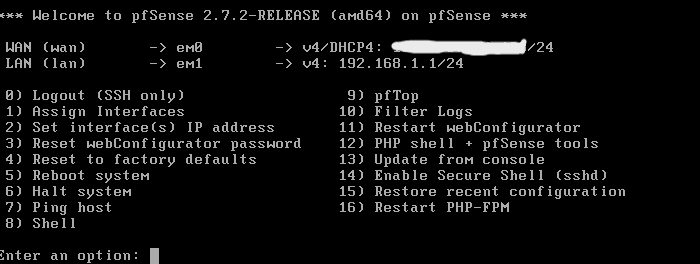
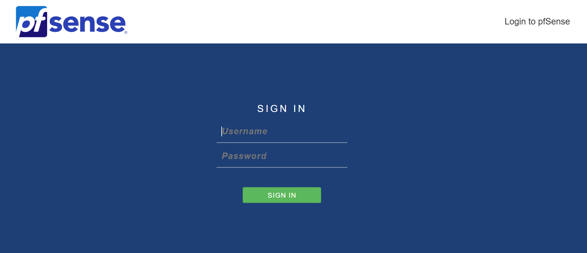
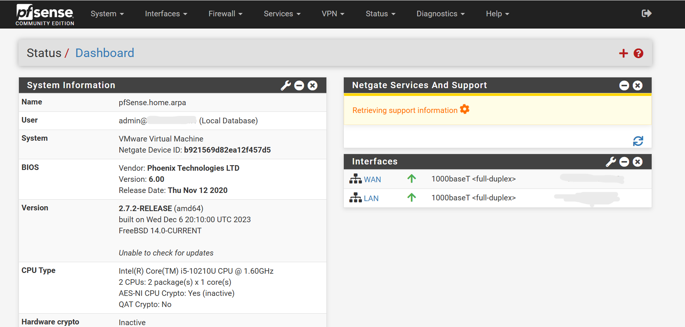
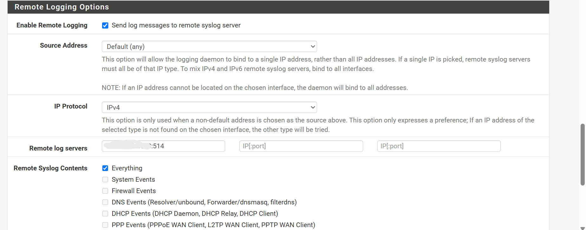

# pfSense Log Integration

This chapter adds firewall visibility to the SOC lab by forwarding pfSense logs to Wazuh. pfSense acts as the network gateway, while Wazuh collects and analyzes the firewall events.

## Technical Context

A firewall controls traffic according to policy and can log allowed, blocked, authentication, DHCP, DNS, VPN, and system events. pfSense is used here as the lab gateway and firewall.

Forwarding pfSense logs to Wazuh gives the SOC workflow network-edge visibility. Firewall events can then be compared with endpoint and IDS telemetry instead of being reviewed as isolated records.

**Implemented controls:**

- Built the pfSense VM with WAN and LAN interfaces.
- Validated access to the pfSense web interface.
- Enabled remote syslog forwarding to Wazuh.
- Added Wazuh syslog input, decoder, and rule snippets for pfSense events.

---

## Detailed Walkthrough

### Step 01 - Build the pfSense Firewall VM

The pfSense VM is created in VMware with two network adapters. Adapter 1 is used as WAN through NAT, and Adapter 2 is used as the isolated LAN side for the lab.

> Interface direction matters in firewall projects. WAN represents the outside-facing side, while LAN represents the internal lab network that should be protected and monitored. If WAN and LAN are mixed up, the firewall can expose the wrong side of the lab or fail to route traffic correctly.



<p><sub><strong>Screenshot 010 - pfSense Interface Assignment:</strong> pfSense console shows interface assignment and the LAN management address, confirming the firewall has a reachable internal interface.</sub></p>

The console confirms that pfSense has a LAN address and can be managed from the lab side.

---

### Step 02 - Access the pfSense Web Interface

A LAN-connected VM accesses `https://192.168.1.1/`. The default credentials are used only for initial isolated lab setup.

> Default firewall credentials are acceptable only during isolated lab setup. In real environments, leaving default credentials active is a serious exposure.

```text
URL: https://192.168.1.1/
Username: admin
Password: pfsense
```



<p><sub><strong>Screenshot 011 - pfSense Web Login:</strong> The pfSense login page is reachable from the LAN side, confirming browser access to the firewall interface.</sub></p>



<p><sub><strong>Screenshot 012 - pfSense Dashboard:</strong> The pfSense dashboard confirms that the firewall is running and accessible for configuration.</sub></p>

The dashboard validates that the firewall is operational before log forwarding is configured.

---

### Step 03 - Enable pfSense Remote Logging

Remote logging is enabled under `Status -> System Logs -> Settings`. The Wazuh server IP is added as the remote syslog destination on UDP port `514`, and relevant categories such as system, firewall, VPN, DHCP, and DNS logs are selected.

> Syslog forwarding allows network gateway events to leave pfSense and reach the SIEM. Without this step, Wazuh cannot correlate firewall activity with endpoint or IDS telemetry.

```text
Remote syslog server: <WAZUH_SERVER_IP>
Syslog port: 514/UDP
Forwarded categories: System, Firewall, VPN, DHCP, DNS
```



<p><sub><strong>Screenshot 013 - pfSense Remote Logging:</strong> pfSense remote logging settings show the Wazuh server configured as the syslog destination.</sub></p>

The screenshot confirms that pfSense is configured to send selected log categories to the Wazuh server.

---

### Step 04 - Configure Wazuh Syslog Input and pfSense Parsing

Wazuh must listen for syslog on UDP port `514`, and custom decoder/rule logic can be added to identify pfSense firewall events. The decoder extracts fields such as source IP, destination IP, protocol, and ports, while rules assign alert levels for allowed traffic, blocked traffic, successful logins, and authentication errors.

> Syslog is the transport path for sending firewall events to the SIEM. A syslog listener receives the raw message, but decoders and rules give it security meaning. Parsing turns text into fields that analysts can search, filter, and alert on.

```xml
<remote>
  <connection>syslog</connection>
  <port>514</port>
  <protocol>udp</protocol>
  <allowed-ips>YOUR_PFSENSE_IP</allowed-ips>
  <local_ip>YOUR_WAZUH_SERVER_IP</local_ip>
</remote>
```

```xml
<rule id="100114" level="7">
  <if_sid>100111</if_sid>
  <match>block</match>
  <description>pfSense: Blocked traffic from $(srcip) to $(dstip)</description>
</rule>
```

The custom rule levels give firewall events different investigation weight: normal visibility for allowed traffic, warning-level evidence for blocks, and higher severity for authentication errors.

Full snippets are stored in [pfsense-syslog-input.xml](pfsense-syslog-input.xml), [pfsense-custom-decoder.xml](pfsense-custom-decoder.xml), and [pfsense-custom-rules.xml](pfsense-custom-rules.xml).

The configuration partially validates pfSense integration by defining the forwarding path and parsing logic. A production deployment would also validate live received events in Wazuh and test each custom rule against real pfSense `filterlog` samples.

---

## Validation and Summary

pfSense is reachable, remote logging is configured, and Wazuh has syslog input and parsing snippets prepared. The evidence confirms configuration; live log receipt and decoder matching should still be tested with actual pfSense `filterlog` samples before relying on the custom rules.

---

## Project Chapters

| # | Chapter | Description |
|---|---------|-------------|
| 0 | [Project Overview](../../README.md) | Main project overview, objectives, tools, and skills |
| 1 | [Topology and Lab Environment](../01-topology-and-lab-environment/README.md) | Lab architecture, component roles, telemetry flow, and trust boundaries |
| 2 | [Wazuh Server and Agent Onboarding](../02-wazuh-server-agent-onboarding/README.md) | Wazuh OVA access, service recovery, and Windows agent registration |
| 3 | [pfSense Log Integration](../03-pfsense-log-integration/README.md) | Firewall setup, remote syslog forwarding, and Wazuh decoder/rule logic |
| 4 | [Suricata IDS Integration](../04-suricata-ids-integration/README.md) | Suricata EVE JSON logging, Wazuh ingestion, and alert validation |
| 5 | [VirusTotal Threat Intelligence](../05-virustotal-threat-intelligence/README.md) | API key handling, Wazuh manager integration, and monitored directory enrichment |
| 6 | [File Integrity Monitoring](../06-file-integrity-monitoring/README.md) | Windows FIM configuration and file-change alert validation |
| 7 | [Sysmon Log Ingestion](../07-sysmon-log-ingestion/README.md) | Windows Event Log concepts, Sysmon setup, and EventChannel ingestion |
| 8 | [SSH Brute Force Detection](../08-ssh-brute-force-detection/README.md) | Hydra simulation, Wazuh detection, and Windows Event 4625 analysis |
| 9 | [Final Summary](../09-final-summary/README.md) | Validation summary, production recommendations, and skills demonstrated |
