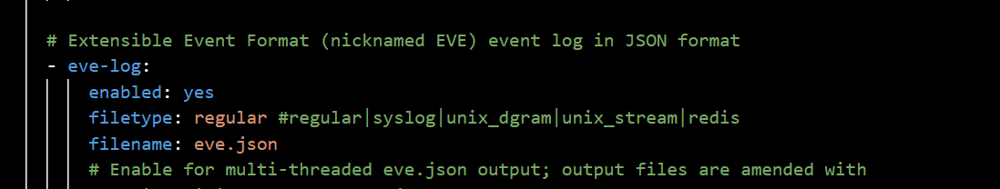
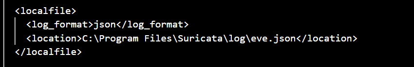
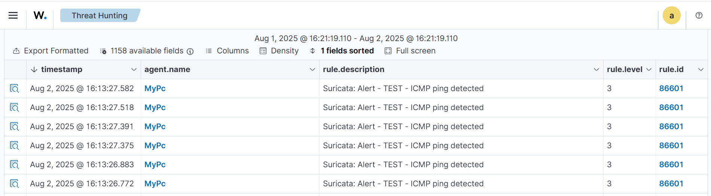

# Suricata IDS Integration

This chapter integrates Suricata with Wazuh so network IDS alerts can be reviewed in the SIEM. Suricata inspects traffic and writes structured EVE JSON logs that the Wazuh agent can collect.

---

## Purpose

The goal is to install Suricata on Windows, verify packet capture support through Npcap, enable EVE JSON output, configure the Wazuh agent to read `eve.json`, and validate Suricata alerts in Wazuh.

## Technical Context

Intrusion Detection Systems and Intrusion Prevention Systems are important parts of layered network defense. They inspect traffic for known threats, suspicious patterns, indicators of compromise, and policy violations. The key difference is what happens after detection.

An IDS, or Intrusion Detection System, inspects traffic and generates alerts or logs when it finds suspicious activity. IDS detection can use signatures and rules, known indicators such as hashes, domains, URLs, TLS or SSH fingerprints, protocol anomalies, and scripting logic such as Lua-based detection. An IDS is mainly visibility-focused: it tells the analyst what happened, but it does not normally block the traffic.

An IPS, or Intrusion Prevention System, is enforcement-focused. It can allow, drop, or reject traffic based on inspection results. IPS mode is more powerful but also riskier because poorly tuned rules can block legitimate traffic.

Suricata is an open-source network threat detection engine that can operate as both IDS and IPS. In this lab, Suricata is used mainly in IDS mode so suspicious network activity is logged and then sent to Wazuh for SIEM visibility. EVE JSON is the structured output format used by Suricata; it makes fields such as alert signature, source IP, destination IP, protocol, and event type easier for Wazuh to parse and search.

## IDS vs. IPS Overview

| Technology | Main Role | How It Works | Lab Meaning |
|------------|-----------|--------------|-------------|
| IDS | Detects suspicious traffic and generates alerts | Uses signatures, rules, IoCs, protocol indicators, TLS/SSH fingerprints, anomalies, and scripting logic | Provides visibility into suspicious traffic without blocking it |
| IPS | Detects and enforces traffic decisions | Can allow, drop, or reject traffic based on inspection results | Useful for prevention, but requires careful tuning to avoid blocking legitimate traffic |

In this project, Suricata is treated as an IDS sensor. That means the main goal is to generate network-security evidence and forward it into Wazuh, not to prove live blocking.

## Steps Covered

| Step | Description |
|------|-------------|
| Install and prepare Suricata | Install Suricata and Npcap |
| Enable EVE JSON | Configure `suricata.yaml` |
| Ingest EVE logs | Add Wazuh agent localfile entry |
| Validate alerts | Generate test traffic and review Threat Hunting |

---

## Detailed Walkthrough

### Step 01 - Install Suricata and Verify Npcap

Suricata is installed on Windows from the official installer. The installation directory is `C:\Program Files\Suricata\`, and the important components include `suricata.exe` as the main executable, `suricata.yaml` as the configuration file, `rules\` as the rule directory, and `log\` as the output folder.

Npcap is required so Suricata can capture packets from the network interface. Without packet capture support, Suricata may be installed correctly but still fail to inspect live traffic.

> Packet capture is the sensor layer for IDS visibility. If Npcap is missing or stopped, Suricata may be installed but unable to inspect live traffic.

```powershell
Get-Service -Name npcap
Start-Service -Name npcap
Get-NetAdapter | Select Name, Status
```

The commands verify that Npcap is running and identify the interface name that Suricata should monitor.

The interface name is important because Suricata must listen on the adapter that actually sees the lab traffic. A wrong interface can produce empty logs even when traffic is active elsewhere.

---

### Step 02 - Enable EVE JSON Logging

Suricata is configured to write EVE JSON output to `eve.json`. EVE JSON is useful for SIEM ingestion because fields such as alert signature, source IP, destination IP, protocol, and event type are structured.

Suricata can also write other logs such as `fast.log` for quick alert summaries and `stats.log` for sensor statistics. In this project, `eve.json` is the most important file because Wazuh can ingest it as structured JSON.

> JSON logs are easier for SIEM platforms to parse than plain text logs. This makes dashboards, filters, and detection rules more reliable.

```yaml
outputs:
  - eve-log:
      enabled: yes
      filetype: regular
      filename: eve.json
```



<p><sub><strong>Screenshot 014 - Suricata EVE JSON Logging:</strong> suricata.yaml is configured to write EVE JSON output, which becomes the log file collected by Wazuh.</sub></p>

The screenshot confirms the EVE JSON output configuration. The full snippet is stored in [configs/suricata-eve-json.yaml](../../configs/suricata-eve-json.yaml).

---

### Step 03 - Run Suricata on the Selected Interface

Suricata is started from an administrator PowerShell session using the configuration file and the selected interface name.

> This step activates the IDS sensor. Suricata reads `suricata.yaml`, loads the configured rule files, listens on the selected adapter, and writes detected events to its log directory.

```powershell
cd "C:\Program Files\Suricata\"
suricata -c suricata.yaml -i <interface>
```

The command starts Suricata with the configured rule set and output options.

---

### Step 04 - Configure Wazuh Agent to Read EVE JSON

The Wazuh agent is configured with a `localfile` entry that points to Suricata's `eve.json`. The log format is set to `json` so Wazuh treats the file as structured data.

> Localfile collection lets Wazuh monitor application logs that are not native Windows Event Logs. This is how Suricata events become searchable in Wazuh Threat Hunting.

```xml
<localfile>
  <log_format>json</log_format>
  <location>C:\Program Files\Suricata\log\eve.json</location>
</localfile>
```

```powershell
Restart-Service -Name wazuh
```



<p><sub><strong>Screenshot 015 - Wazuh Localfile for Suricata EVE:</strong> The Wazuh agent configuration points to the Suricata EVE JSON log file.</sub></p>

The screenshot confirms the localfile path used by Wazuh. The full snippet is stored in [configs/suricata-wazuh-localfile.xml](../../configs/suricata-wazuh-localfile.xml).

---

### Step 05 - Generate Traffic and Validate Alerts

Test traffic is generated and the Wazuh dashboard is filtered for Suricata-related events. The lab uses basic traffic generation to confirm the ingestion path.

> A test command validates the pipeline, not full detection coverage. More realistic attacks or known test signatures would be required to validate a production IDS policy.

```powershell
ping google.com
```



<p><sub><strong>Screenshot 016 - Suricata Alerts in Wazuh:</strong> Wazuh Threat Hunting displays Suricata events, confirming that Suricata logs are reaching the SIEM.</sub></p>

The evidence confirms Suricata-to-Wazuh log visibility. It does not prove that every Suricata rule is tuned or that IPS blocking is enabled.

---

## Validation

Suricata writes EVE JSON, Wazuh reads the log file, and Suricata events appear in Wazuh Threat Hunting. This validates the IDS log-ingestion path.

## Chapter Summary

Suricata adds network detection telemetry to the lab. The next chapter adds VirusTotal enrichment so Wazuh can enrich file-related alerts with external reputation context.

---

## Project Chapters

| Chapter | Description |
|---------|-------------|
| [Project Overview](../01-project-overview/README.md) | Scenario, architecture, tools, and lab traffic flow |
| [Wazuh Server and Agent Onboarding](../02-wazuh-server-agent-onboarding/README.md) | Wazuh OVA deployment, dashboard access, service recovery, and Windows agent registration |
| [pfSense Log Integration](../03-pfsense-log-integration/README.md) | Firewall VM setup, remote syslog forwarding, and Wazuh decoder/rule logic |
| [Suricata IDS Integration](../04-suricata-ids-integration/README.md) | Suricata installation, EVE JSON logging, Wazuh ingestion, and alert validation |
| [VirusTotal Threat Intelligence](../05-virustotal-threat-intelligence/README.md) | API key handling, Wazuh manager integration, and monitored directory enrichment |
| [File Integrity Monitoring](../06-file-integrity-monitoring/README.md) | Windows FIM configuration and file create/modify/delete alert validation |
| [Sysmon Log Ingestion](../07-sysmon-log-ingestion/README.md) | Windows Event Log concepts, Sysmon installation, and EventChannel ingestion |
| [SSH Brute Force Detection](../08-ssh-brute-force-detection/README.md) | Hydra simulation, Wazuh detection, Windows Event 4625 analysis, and defensive controls |
| [Final Summary](../09-final-summary/README.md) | Results, limitations, skills, and hardening recommendations |
