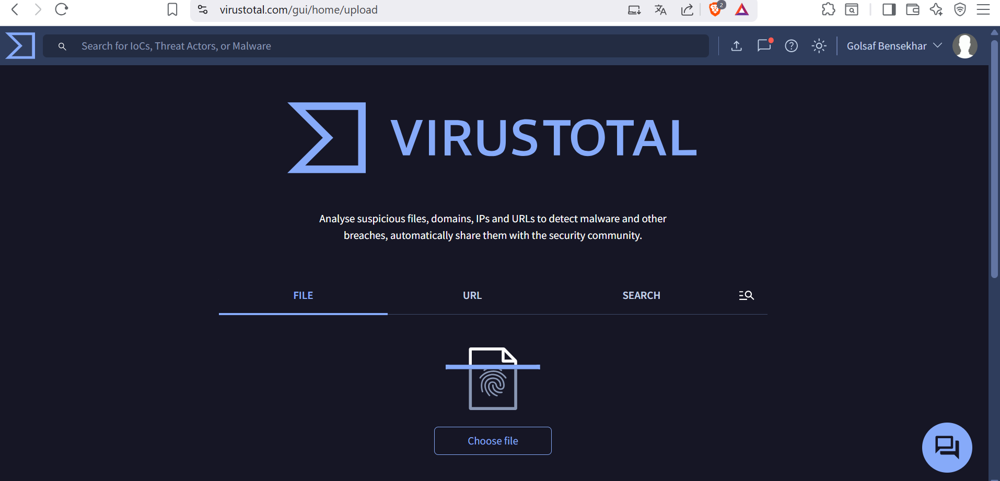
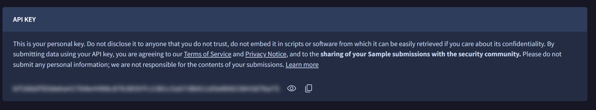
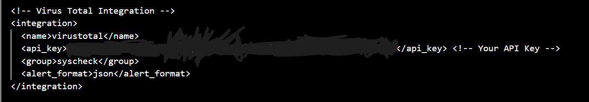
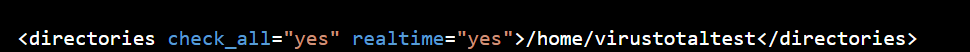

# VirusTotal Threat Intelligence

This chapter integrates VirusTotal with Wazuh so file-monitoring alerts can be enriched with external reputation data. VirusTotal checks files, URLs, domains, and IP addresses against many security engines and community intelligence sources.

---

## Purpose

The goal is to obtain a VirusTotal API key, configure the Wazuh manager integration, define a monitored test directory, and use file activity as the trigger for enrichment.

## Technical Context

Threat intelligence adds context to raw alerts. In a SOC, analysts may review many alerts every day, and a single local event often does not provide enough information to decide whether it is suspicious. A new file event by itself may only show that something changed; enrichment can add reputation data that helps analysts decide whether the file deserves priority review.

VirusTotal is a threat-intelligence and reputation platform that can analyze files, URLs, domains, and IP addresses against many antivirus engines and community intelligence sources. It can help retrieve file hashes, identify known malware detections, review URL or domain reputation, and provide metadata that supports investigation.

When integrated with Wazuh, VirusTotal can enrich alerts automatically when file activity is detected by Wazuh syscheck. This does not replace local analysis, but it gives the analyst another layer of context for triage.

> Files and URLs submitted to VirusTotal may become visible to the security community. Sensitive, proprietary, or private data should not be uploaded.

## Steps Covered

| Step | Description |
|------|-------------|
| Open VirusTotal | Review platform purpose |
| Obtain API key | Copy personal API key securely |
| Configure Wazuh manager | Add integration block to manager config |
| Configure monitored directory | Trigger lookups from file activity |

---

## Detailed Walkthrough

### Step 01 - Review VirusTotal as an Enrichment Source

VirusTotal is used as an external enrichment source for suspicious files, URLs, domains, and IPs. In a SOC workflow, this helps analysts quickly add context to a Wazuh alert by checking whether other security engines or community reports have already seen the same indicator.

> A reputation lookup is not a final verdict by itself. It helps prioritize investigation, but the local endpoint behavior, file origin, process activity, network traffic, and surrounding logs still matter.



<p><sub><strong>Screenshot 017 - VirusTotal Upload Interface:</strong> VirusTotal provides file, URL, and search workflows that can support threat-intelligence enrichment.</sub></p>

The screenshot confirms access to the VirusTotal interface used for enrichment and manual lookup context.

This workflow is useful for triage. For example, if a new file appears in a monitored folder and VirusTotal reports detections for the same hash, the analyst can treat the alert with higher priority. If the reputation is clean, the alert still needs context because new or targeted malware may not be detected yet.

---

### Step 02 - Obtain and Protect the VirusTotal API Key

A personal API key is generated from the VirusTotal profile page. The key is sensitive because it authenticates API requests and should not be shared or embedded in public scripts.

> API keys are credentials. They should be stored securely, redacted in screenshots, and rotated if exposed.



<p><sub><strong>Screenshot 018 - VirusTotal API Key:</strong> The VirusTotal API key page is shown with the key blurred, confirming that the credential was obtained without exposing it publicly.</sub></p>

The evidence confirms that an API key was available for the integration while keeping the credential redacted.

---

### Step 03 - Configure VirusTotal on the Wazuh Manager

The VirusTotal integration belongs on the Wazuh manager configuration because the manager performs the alert processing and integration lookup. The corrected manager path is `/var/ossec/etc/ossec.conf`.

> The Wazuh manager integration is different from an endpoint agent setting. Placing this block on the manager keeps enrichment centralized.

```xml
<integration>
  <name>virustotal</name>
  <api_key>YOUR_API_KEY</api_key>
  <group>syscheck</group>
  <alert_format>json</alert_format>
</integration>
```

```bash
sudo nano /var/ossec/etc/ossec.conf
sudo systemctl restart wazuh-manager
```



<p><sub><strong>Screenshot 019 - Wazuh VirusTotal Integration Block:</strong> The Wazuh integration block references VirusTotal and uses a redacted API key.</sub></p>

The snippet is stored in [configs/virustotal-manager-integration.xml](../../configs/virustotal-manager-integration.xml). The evidence confirms the integration block, while successful enrichment still requires a file event that triggers a Wazuh alert.

---

### Step 04 - Define the Monitored Test Directory

A directory is monitored so new file activity can trigger the Wazuh syscheck workflow and VirusTotal lookup. For a Windows endpoint in this lab, the corrected monitored test path is `C:\Users\dell\virustotaltest`.

> The monitored path must match the endpoint operating system. A Linux path can be valid on Linux agents, while a Windows endpoint needs a Windows path.

```xml
<syscheck>
  <directories realtime="yes">C:\Users\dell\virustotaltest</directories>
</syscheck>
```



<p><sub><strong>Screenshot 020 - VirusTotal Monitored Directory Syntax:</strong> The screenshot demonstrates the Wazuh syscheck directory syntax used to trigger VirusTotal lookups when files appear in a monitored path.</sub></p>

The corrected Windows snippet is stored in [configs/virustotal-windows-syscheck.xml](../../configs/virustotal-windows-syscheck.xml). The screenshot confirms the monitoring concept; the public configuration uses the Windows path appropriate for this endpoint lab.

---

## Validation

The API key is obtained, the Wazuh manager integration block is configured, and a monitored test directory is defined. A complete validation would add a test file and confirm the resulting VirusTotal-enriched alert in Wazuh.

## Chapter Summary

VirusTotal enrichment gives Wazuh additional reputation context for file-related alerts. The next chapter uses File Integrity Monitoring to detect file creation, modification, and deletion on the Windows endpoint.

---

## Project Chapters

| Chapter | Description |
|---------|-------------|
| [Project Overview](../01-project-overview/README.md) | Scenario, architecture, tools, and lab traffic flow |
| [Wazuh Server and Agent Onboarding](../02-wazuh-server-agent-onboarding/README.md) | Wazuh OVA deployment, dashboard access, service recovery, and Windows agent registration |
| [pfSense Log Integration](../03-pfsense-log-integration/README.md) | Firewall VM setup, remote syslog forwarding, and Wazuh decoder/rule logic |
| [Suricata IDS Integration](../04-suricata-ids-integration/README.md) | Suricata installation, EVE JSON logging, Wazuh ingestion, and alert validation |
| [VirusTotal Threat Intelligence](../05-virustotal-threat-intelligence/README.md) | API key handling, Wazuh manager integration, and monitored directory enrichment |
| [File Integrity Monitoring](../06-file-integrity-monitoring/README.md) | Windows FIM configuration and file create/modify/delete alert validation |
| [Sysmon Log Ingestion](../07-sysmon-log-ingestion/README.md) | Windows Event Log concepts, Sysmon installation, and EventChannel ingestion |
| [SSH Brute Force Detection](../08-ssh-brute-force-detection/README.md) | Hydra simulation, Wazuh detection, Windows Event 4625 analysis, and defensive controls |
| [Final Summary](../09-final-summary/README.md) | Results, limitations, skills, and hardening recommendations |
