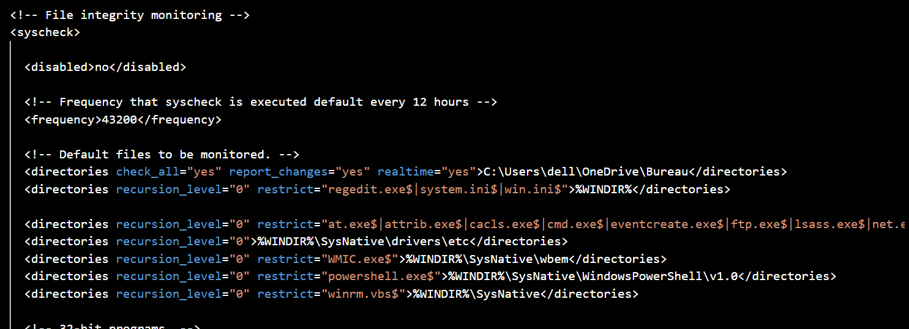
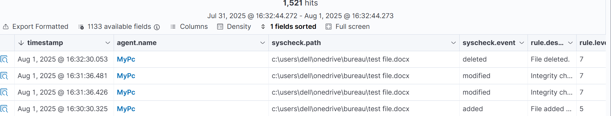

# File Integrity Monitoring

This chapter configures Wazuh File Integrity Monitoring on the Windows endpoint. FIM tracks changes to files and folders and creates alerts when monitored content is added, modified, or deleted.

---

## Purpose

The goal is to monitor a Windows desktop path and validate that Wazuh detects file creation, modification, and deletion events.

## Technical Context

Attackers do not always only log in or run obvious tools. Many attacks change the system: ransomware encrypts user files, malware drops payloads, attackers modify configuration files, and intruders may tamper with logs or scripts to hide activity. Detecting those changes quickly is important because file activity can be one of the first visible signs of compromise.

File Integrity Monitoring, or FIM, tracks files and directories for creation, modification, deletion, permission changes, and other integrity changes. In Wazuh, this is handled by the `syscheck` module. FIM also supports compliance requirements in frameworks such as PCI-DSS, HIPAA, and ISO 27001, where organizations need evidence that important files are monitored for unauthorized changes.

## Steps Covered

| Step | Description |
|------|-------------|
| Configure syscheck | Monitor a Windows folder in real time |
| Validate file events | Create, modify, and delete a test file |

---

## Detailed Walkthrough

### Step 01 - Configure Windows FIM in the Wazuh Agent

The Windows endpoint agent configuration is edited at `C:\Program Files (x86)\ossec-agent\ossec.conf`. The monitored path is added under `<syscheck>` with change reporting and real-time monitoring enabled.

> Windows agent configuration should use the Windows agent path. The manager path `/var/ossec/etc/ossec.conf` is used on Linux-based Wazuh manager systems, not for editing a Windows endpoint agent.

```xml
<syscheck>
  <disabled>no</disabled>
  <directories check_all="yes" report_changes="yes" realtime="yes">C:\Users\dell\OneDrive\Bureau</directories>
</syscheck>
```

```powershell
notepad "C:\Program Files (x86)\ossec-agent\ossec.conf"
Restart-Service -Name WazuhSvc
```

In this configuration, `check_all="yes"` enables broad file attribute checks, `report_changes="yes"` allows Wazuh to report content changes where supported, and `realtime="yes"` makes the agent watch the folder continuously instead of only waiting for scheduled scans.



<p><sub><strong>Screenshot 021 - FIM Syscheck Configuration:</strong> The Wazuh syscheck block monitors the Windows desktop path with `check_all`, `report_changes`, and `realtime` enabled.</sub></p>

The screenshot confirms the FIM configuration for the monitored folder. The full snippet is stored in [configs/fim-windows-syscheck.xml](../../configs/fim-windows-syscheck.xml).

---

### Step 02 - Validate File Creation, Modification, and Deletion

A test document named `test file.docx` is created, modified, and deleted in the monitored directory. Wazuh reports those actions as syscheck events.

> FIM validation should include more than one event type. Creation, modification, and deletion prove that the monitored path reacts to different file-state changes, not only to the first appearance of a file.



<p><sub><strong>Screenshot 022 - FIM Alerts Dashboard:</strong> Wazuh shows added, modified, and deleted events for `test file.docx` under the monitored Windows path.</sub></p>

The evidence confirms that Wazuh detected file changes from the monitored path. It does not prove full ransomware detection coverage, but it validates the file-change monitoring workflow.

---

## Validation

Wazuh generated FIM alerts for file creation, modification, and deletion. This confirms the monitored directory is active and that endpoint file changes are visible in the SIEM.

## Chapter Summary

FIM adds host-level change detection to the lab. The next chapter adds Sysmon, which provides deeper Windows process and event telemetry.

---

## Project Chapters

| Chapter | Description |
|---------|-------------|
| [Project Overview](../01-project-overview/README.md) | Scenario, architecture, tools, and lab traffic flow |
| [Wazuh Server and Agent Onboarding](../02-wazuh-server-agent-onboarding/README.md) | Wazuh OVA deployment, dashboard access, service recovery, and Windows agent registration |
| [pfSense Log Integration](../03-pfsense-log-integration/README.md) | Firewall VM setup, remote syslog forwarding, and Wazuh decoder/rule logic |
| [Suricata IDS Integration](../04-suricata-ids-integration/README.md) | Suricata installation, EVE JSON logging, Wazuh ingestion, and alert validation |
| [VirusTotal Threat Intelligence](../05-virustotal-threat-intelligence/README.md) | API key handling, Wazuh manager integration, and monitored directory enrichment |
| [File Integrity Monitoring](../06-file-integrity-monitoring/README.md) | Windows FIM configuration and file create/modify/delete alert validation |
| [Sysmon Log Ingestion](../07-sysmon-log-ingestion/README.md) | Windows Event Log concepts, Sysmon installation, and EventChannel ingestion |
| [SSH Brute Force Detection](../08-ssh-brute-force-detection/README.md) | Hydra simulation, Wazuh detection, Windows Event 4625 analysis, and defensive controls |
| [Final Summary](../09-final-summary/README.md) | Results, limitations, skills, and hardening recommendations |
