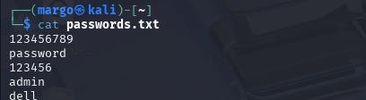
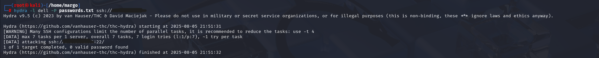
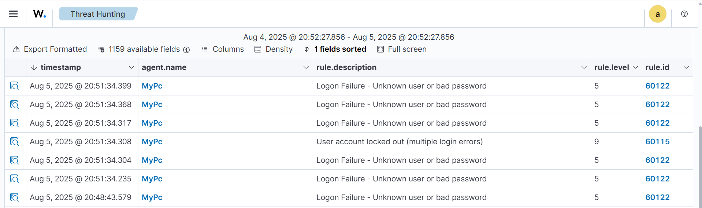

# SSH Brute Force Detection

This chapter simulates an SSH brute-force attack from Kali Linux against a Windows target with OpenSSH enabled. Wazuh is then used to detect and analyze the repeated failed logon activity.

## Technical Context

A brute-force attack repeatedly tries username and password combinations until one succeeds. Related patterns include dictionary attacks with prepared wordlists, hybrid attacks that modify dictionary words, reverse brute-force attacks that test one password against many users, and credential stuffing with leaked credentials.

Hydra is used only inside the lab to generate controlled SSH authentication failures. It supports many protocols, including SSH, FTP, HTTP, RDP, and Telnet.

> Brute-force testing must only be performed against systems you own or have explicit permission to test. Outside a lab, unauthorized password attacks are illegal and harmful.

**Implemented controls:**

- Prepared a controlled password list on Kali.
- Ran Hydra against the lab SSH service.
- Reviewed Wazuh failed-logon and lockout-style alerts.
- Analyzed Windows Event 4625 fields behind the detection.

---

## Detailed Walkthrough

### Step 01 - Prepare the Password List

A small password list is created on Kali Linux. Hydra uses this list to test multiple passwords against the target SSH service.

> The password list controls the scope of the simulation. A small list is enough to validate detection without creating unnecessary noise. In this lab, the goal is not to break into the target; the goal is to create recognizable failed-login telemetry.

```bash
cat passwords.txt
```



<p><sub><strong>Screenshot 023 - Hydra Password List:</strong> Kali shows the password list used for the controlled SSH brute-force simulation.</sub></p>

The screenshot confirms the input used by Hydra during the lab attack simulation.

---

### Step 02 - Run Hydra Against SSH

Hydra is launched with the known target username `dell` and the prepared password file. The target is the Windows system with OpenSSH Server enabled.

> SSH on Windows is not enabled by default. The test requires OpenSSH Server to be installed and running on the Windows target.

```bash
hydra -L <username_file> -P <password_file> <target>
hydra -l dell -P passwords.txt ssh://<target_ip>
```

The uppercase `-L` option is used when Hydra should read usernames from a file. The lowercase `-l` option is used when the username is already known and entered directly. The `-P` option points Hydra to the password list.



<p><sub><strong>Screenshot 024 - Hydra SSH Command:</strong> Hydra runs from Kali against the SSH service using the `dell` username and the prepared password list.</sub></p>

Hydra creates multiple authentication attempts, which should appear as failed logons on the Windows target.

---

### Step 03 - Detect the Brute Force Activity in Wazuh

After the simulation, Wazuh Threat Hunting shows multiple failed SSH logons and an account lockout style alert. The visible rules include repeated `Logon Failure - Unknown user or bad password` events and a higher-severity lockout event.

> A single failed login can be normal. Multiple failures in a short time window from the same pattern become brute-force evidence.



<p><sub><strong>Screenshot 025 - Wazuh Brute Force Alerts:</strong> Wazuh shows repeated failed logon alerts for agent `MyPc`, including rule level 5 failed-logon events and a higher-level account-lockout event.</sub></p>

The screenshot confirms Wazuh detection of the authentication attack pattern.

---

### Step 04 - Analyze Windows Event 4625

Windows Event ID `4625` records failed logon attempts. In this lab, the event data shows SSH-related logon failures handled by `sshd.exe`, with the failure reason indicating an unknown username or bad password.

> Field-level analysis matters because the alert title alone does not explain the access method. The process name, logon type, status, substatus, and fired count show why this is SSH brute-force behavior instead of a single normal mistyped password.

| Field | Value | Meaning |
|-------|-------|---------|
| `data.win.system.eventID` | `4625` | Failed logon attempt |
| `data.win.eventdata.failureReason` | `%%2313` | Unknown user name or bad password |
| `data.win.eventdata.logonType` | `8` | NetworkCleartext logon type |
| `data.win.eventdata.status` | `0xc000006d` | Logon failure |
| `data.win.eventdata.subStatus` | `0xc0000064` | Unknown username or bad password condition |
| `data.win.eventdata.processName` | `C:\Windows\System32\OpenSSH\sshd.exe` | SSH service handled the attempt |
| `rule.firedtimes` | `14` | Similar failed logons occurred repeatedly |

The full field table is stored in [logs/windows-event-4625-field-analysis.md](../../logs/windows-event-4625-field-analysis.md).

The important conclusion is that the Windows endpoint `MyPc` received repeated SSH login attempts handled by `sshd.exe`. Wazuh parsed the Windows Security event through EventChannel, classified the activity as failed authentication, and showed that the same rule fired multiple times. That pattern is what makes the event suspicious in a SOC workflow.

---

## Validation and Summary

The lab confirms that Hydra generated repeated SSH authentication failures and that Wazuh detected the behavior through Windows Security events. This validates the end-to-end detection path: attack simulation, Windows event generation, Wazuh ingestion, alerting, and field-level analysis.

---

## Project Chapters

| # | Chapter | Description |
|---|---------|-------------|
| 0 | [Project Overview](../../README.md) | Main project overview, objectives, tools, and skills |
| 1 | [Topology and Lab Environment](../01-topology-and-lab-environment/README.md) | Lab architecture, component roles, telemetry flow, and trust boundaries |
| 2 | [Wazuh Server and Agent Onboarding](../02-wazuh-server-agent-onboarding/README.md) | Wazuh OVA access, service recovery, and Windows agent registration |
| 3 | [pfSense Log Integration](../03-pfsense-log-integration/README.md) | Firewall setup, remote syslog forwarding, and Wazuh decoder/rule logic |
| 4 | [Suricata IDS Integration](../04-suricata-ids-integration/README.md) | Suricata EVE JSON logging, Wazuh ingestion, and alert validation |
| 5 | [VirusTotal Threat Intelligence](../05-virustotal-threat-intelligence/README.md) | API key handling, Wazuh manager integration, and monitored directory enrichment |
| 6 | [File Integrity Monitoring](../06-file-integrity-monitoring/README.md) | Windows FIM configuration and file-change alert validation |
| 7 | [Sysmon Log Ingestion](../07-sysmon-log-ingestion/README.md) | Windows Event Log concepts, Sysmon setup, and EventChannel ingestion |
| 8 | [SSH Brute Force Detection](../08-ssh-brute-force-detection/README.md) | Hydra simulation, Wazuh detection, and Windows Event 4625 analysis |
| 9 | [Final Summary](../09-final-summary/README.md) | Validation summary, production recommendations, and skills demonstrated |
